# mmWave literature evidence and decision ledger — 2026-08-29

Status: `ACTIVE / CANONICAL DISCUSSION RECORD`

Purpose: persist literature evidence, project interpretations, discussion decisions, and audit requirements that would otherwise be lost in chat. This ledger is not itself a scientific result and does not authorize reruns.

## 1. Governance rule fixed in this project

Effective immediately, any material scientific or execution decision discussed for this project must be written to GitHub in the same work cycle. Chat-only conclusions are not considered durable project state.

A material decision includes at minimum: changing/qualifying a scientific conclusion; choosing or rejecting an analysis; defining a processing/QC rule; interpreting a failure mode; deciding that a method is frozen, superseded, blocked, or allowed; establishing literature-supported requirements; changing a denominator/threshold/producer contract; or changing the next scientific step.

Each durable record must distinguish:

- `LITERATURE_EVIDENCE`: what a cited paper/review actually supports.
- `PROJECT_EVIDENCE`: what current repository/data/results actually show.
- `INFERENCE`: interpretation connecting the two; never presented as direct source fact.
- `DECISION`: project action/boundary adopted from the evidence.
- `OPEN_AUDIT`: unresolved question that still requires code/data verification.

If a future discussion changes any item below, update this ledger (or a clearly linked successor) plus the project status/decision index as appropriate.

## 2. Current decision checkpoint from the 2026-08-29 discussion

### DECISION D-20260829-01 — Do not run Issue #16 yet

`#16 quality-stratified sensitivity` is paused until the formal mmWave producer/downstream processing chain has been audited against literature-supported processing requirements.

Reason: the corrected `33/37/2` tier split cannot be interpreted as acquisition quality by itself. The experiment protocol required minimal movement and participants were observed to cooperate seriously; therefore the project must first determine whether failures are acquisition failures or current pipeline/target-selection/QC eligibility failures. This is a project prior/interpretive constraint, not proof that every session is physiologically valid.

### DECISION D-20260829-02 — QC is not physiology validity

`QC-eligible`, stable phase, high SNR, plausible distance, or good coverage are not sufficient to claim that selected radar content is a valid chest/HR/BR target. The project already has BIOPAC evidence that respiratory harmonics can yield stable but wrong HR-like peaks; physiology validity requires independent reference evidence.

### DECISION D-20260829-03 — 33/37 must not be translated into “33 good acquisitions / 37 bad acquisitions”

Until the pipeline audit is complete, `Tier1/Tier2` is to be interpreted as `current pipeline eligibility`, not as a direct measure of participant compliance or acquisition quality.

### DECISION D-20260829-04 — Required next deliverable

Before any new #16 model run, produce:

1. a literature processing standard;
2. a line-by-line/logic-block audit of the formal producer and downstream mmWave code;
3. a literature-vs-project stage matrix;
4. a missing/unjustified processing list;
5. a visual flowchart preserved in GitHub (Mermaid or other source-controlled form).

No new algorithm development, C2B/C2C rerun, NIR/RGB producer modification, or raw-data modification is authorized by this decision.

## 3. Literature-supported reference processing chain

This is a synthesis layer, not a claim that every paper implements every step identically.

```mermaid
flowchart LR
    A[ADC / IF samples] --> B[DC / static clutter handling]
    B --> C[Windowing / calibration where applicable]
    C --> D[Range FFT / range profile]
    D --> E[Chirp aggregation / Doppler or zero-Doppler handling]
    E --> F[Channel handling]
    F --> G[Human target / range-bin selection]
    G --> H[Range-bin tracking / continuity if used]
    H --> I[Complex phase extraction]
    I --> J[Phase unwrap / DACM / phase correction]
    J --> K[Detrend / baseline / artifact handling]
    K --> L[Respiration-heart separation]
    L --> M[Respiratory harmonic handling]
    M --> N[HR / BR estimation]
    N --> O[Beat timing / IBI if HRV is claimed]
    O --> P[HRV metrics]
    N --> Q[Reference validation]
    P --> Q
    Q[ECG / PPG / RSP: MAE, bias/agreement, Bland-Altman, paired denominator]
```

Important: this chain is a literature-derived audit scaffold. Some methods replace individual blocks with alternative techniques (e.g. 2D-FFT + velocity estimation rather than range-bin phase tracking). Such paper-specific alternatives must be labeled `PROJECT_VARIANT` or paper-specific, not treated as universal standards.

## 4. Literature evidence registry

### L1 — Kebe et al., 2020 — review

- Title: *Human Vital Signs Detection Methods and Potential Using Radars: A Review*
- Journal: Sensors 20(5):1454
- DOI: `10.3390/s20051454`
- PMCID: `PMC7085680`
- URL: https://pmc.ncbi.nlm.nih.gov/articles/PMC7085680/
- Type: `REVIEW`
- Supports:
  - FMCW vital-sign processing fundamentally requires subject localization/range association followed by HR/BR extraction.
  - Noise/DC-offset/motion-artifact handling and HR-vs-BR separation are recognized challenges.
  - Random body movement is a distinct technical challenge; it should not be inferred merely from a downstream failure label.
- Does **not** establish one mandatory universal filtering algorithm or parameter set.

### L2 — Alizadeh et al., 2019 — practical 77 GHz FMCW study

- Title: *Remote Monitoring of Human Vital Signs Using mm-Wave FMCW Radar*
- Journal: IEEE Access 7:54958–54968
- DOI: `10.1109/ACCESS.2019.2912956`
- URL: https://doi.org/10.1109/ACCESS.2019.2912956
- Type: `EMPIRICAL_METHOD`
- Supports:
  - Practical 77 GHz FMCW HR/BR extraction uses range localization and phase manipulation/unwrapping.
  - Results should be compared to an external reference sensor.
- Project use: evidence that target/range handling and phase processing are core methodological stages rather than optional reporting details.

### L3 — Choi et al., 2021 — target range selection

- Title: *Selecting Target Range with Accurate Vital Sign Using Spatial Phase Coherency of FMCW Radar*
- Journal: Applied Sciences 11(10):4514
- DOI: `10.3390/app11104514`
- URL: https://www.mdpi.com/2076-3417/11/10/4514
- Type: `EMPIRICAL_METHOD`
- Supports:
  - Selecting a range containing valid vital-sign information is itself a critical estimation problem.
  - Target/range selection should not be equated with simply choosing a strongest reflector without validation.
- Project implication: formal target/bin selection must be audited independently of participant compliance.

### L4 — Wang et al., 2020 — 77 GHz phase/DC processing

- Title: *Remote Monitoring of Human Vital Signs Based on 77-GHz mm-Wave FMCW Radar*
- URL: https://pmc.ncbi.nlm.nih.gov/articles/PMC7285495/
- Type: `EMPIRICAL_METHOD`
- Supports:
  - Range FFT is used to obtain range information/target localization.
  - DC offset correction is explicitly treated before interpreting phase.
  - Extended DACM is used for phase unwrapping/phase recovery.
  - Heartbeat and respiration are then separated/reconstructed before rate estimation.
- Project implication: the exact phase/DC/unwrap sequence in the formal pipeline requires source-level confirmation.

### L5 — high-precision FMCW method, 2022 — phase extraction chain

- Title: *High-Precision Vital Signs Monitoring Method Using a FMCW Millimeter-Wave Sensor*
- URL: https://pmc.ncbi.nlm.nih.gov/articles/PMC9572116/
- Type: `EMPIRICAL_METHOD`
- Supports:
  - DC offset compensation and phase extraction are explicit processing stages.
  - Extended DACM is used to avoid phase breakpoint/drift problems.
- Project implication: any project phase extraction/unwrap/differencing must be checked for equivalence, omission, or double processing.

### L6 — 120 GHz FMCW harmonic study, 2021

- Title: *Non-Contact Monitoring of Human Vital Signs Using FMCW Millimeter Wave Radar in the 120 GHz Band*
- URL: https://pmc.ncbi.nlm.nih.gov/articles/PMC8070581/
- Type: `EMPIRICAL_METHOD`
- Supports:
  - Respiratory 2nd/3rd harmonics can overlap the heartbeat band and be stronger than the true heartbeat component.
  - The study explicitly applies adaptive notch filtering at respiratory harmonics before HR estimation.
- Project implication: a stable/high-SNR HR-like peak can be construct-invalid; current formal HR estimator must be checked for true harmonic rejection versus post-hoc flagging only.

### L7 — Fu et al., 2023 — random body motion cancellation

- Title: *A new method for vital sign detection using FMCW radar based on random body motion cancellation*
- Journal: Biomedical Engineering / Biomedizinische Technik 68(6):617–632
- DOI: `10.1515/bmt-2023-0068`
- PMID: `37289651`
- URL: https://pubmed.ncbi.nlm.nih.gov/37289651/
- Type: `EMPIRICAL_METHOD`
- Supports:
  - Random body motion can be modeled/handled as a distinct signal-processing problem using range-Doppler/velocity and trend-filtering evidence.
  - Motion cancellation is not equivalent to labeling every unstable range/phase window as participant movement.
- Project implication: current `geometry_or_motion` labels must be decomposed into independent motion evidence vs algorithmic/target-selection instability.

### L8 — clinical FMCW respiratory validation

- Title: *Wireless non-invasive continuous respiratory monitoring with FMCW radar: a clinical validation study*
- URL: https://pmc.ncbi.nlm.nih.gov/articles/PMC5082588/
- Type: `CLINICAL_VALIDATION`
- Supports:
  - Repeated-measures Bland–Altman, bias, and 95% limits of agreement are appropriate agreement measures for radar-vs-reference repeated observations.
  - Artifact handling must be explicit; validation can compare complete and artifact-reduced datasets.
- Project implication: correlation alone is insufficient for physiological validation.

### L9 — Sacco et al., 2020 — chest orientation / reference sensors

- Title: *An FMCW Radar for Localization and Vital Signs Measurement for Different Chest Orientations*
- Journal: Sensors 20(12):3489
- DOI: `10.3390/s20123489`
- URL: https://pmc.ncbi.nlm.nih.gov/articles/PMC7348911/
- Type: `EMPIRICAL_VALIDATION`
- Supports:
  - HR/BR estimates are compared with contact reference sensors (PPG and respiratory belt) under multiple body orientations.
- Project implication: orientation/geometry effects require empirical validation; range/phase quality alone is not physiological ground truth.

### L10 — Wang, Yoo & Cho, 2020 — FMCW vs IR-UWB comparison

- Title: *Experimental Comparison of IR-UWB Radar and FMCW Radar for Vital Signs*
- Journal: Sensors 20(22):6695
- DOI: `10.3390/s20226695`
- PMCID: `PMC7768379`
- URL: https://pmc.ncbi.nlm.nih.gov/articles/PMC7768379/
- Type: `COMPARATIVE_EMPIRICAL`
- Supports:
  - FMCW vital-sign estimation uses phase information at an estimated human-body point.
  - ECG and respiratory belt are used as references.
  - Bland–Altman comparison is reported for FMCW RR/HR vs reference.
  - Harmonics and channel combination are explicit performance considerations.

### L11 — Turppa et al., 2020 — IBI/HRV-capable FMCW workflow

- Title: *Vital Sign Monitoring Using FMCW Radar in Various Sleeping Scenarios*
- Journal: Sensors 20(22):6505
- DOI: `10.3390/s20226505`
- PMCID: `PMC7696080`
- URL: https://pmc.ncbi.nlm.nih.gov/articles/PMC7696080/
- Type: `EMPIRICAL_VALIDATION / IBI`
- Supports:
  - Radar IBI is explicitly extracted and compared with reference ECG-derived IBI.
  - The study separates IBI extraction, HR/HRV/RR estimation, and performance evaluation.
  - MAE/RMSE/correlation are used and Bland–Altman is used to visualize agreement; the paper explicitly notes Bland–Altman captures systematic and random error that correlation does not.
- Project implication: an HRV claim requires a beat/IBI-level chain and paired reference validation, not only a window-level HR estimate or an output column named RMSSD.

### L12 — 2025 respiratory-harmonic DSP source previously cited in discussion

- URL cited in discussion: https://www.sciencedirect.com/science/article/pii/S1051200424005359
- Type: `PENDING_METADATA_VERIFICATION`
- Current status: the URL was cited as a recent respiratory-harmonic-removal source, but bibliographic metadata could not be reliably retrieved in the current session because the publisher page blocked automated retrieval.
- Rule: do not use this item as primary evidence until title/authors/DOI/method are independently verified. It is retained here so the citation is not lost.

## 5. Project evidence already relevant to the audit

These are project facts and must not be conflated with the literature above:

- Current formal stored `ReportDataCube1D` has been treated in the canonical project as range-FFT-domain complex data, not raw ADC. The exact upstream ADC→DataCube processing still requires producer/source provenance audit.
- Corrected formal distance semantics are `0.037 m/bin`; previous `0.08 m/bin` downstream interpretation was wrong and materially changed target/channel selections and corrected QC tier counts.
- Issue #15 closure currently records HR=`PASS_QUALITY_GATED`, BR=`PASS_SUPPORTING`, HRV=`BLOCKED`; this does not authorize whole-cohort physiology claims.
- BIOPAC evidence contains respiratory-harmonic confusion that can produce a stable but wrong HR-like target; this is why signal quality cannot substitute for construct validity.
- Corrected tier counts (`33/37/2`) are therefore audit strata, not direct participant-compliance labels.

## 6. Required line-by-line scientific audit fields

The formal audit must create one row/section per executable logic block (line-level where scientifically meaningful) with at least:

`file`, `line_start`, `line_end`, `code/operation`, `stage`, `input shape/type`, `output shape/type`, `mathematical operation`, `scientific purpose`, `literature support`, `parameter`, `parameter source`, `empirical validation`, `risk if omitted`, `risk if duplicated`, `possible respiration attenuation`, `possible heartbeat attenuation`, `harmonic risk`, `bin-hopping risk`, `phase-discontinuity risk`, `distance-semantics dependency`, `status`.

Allowed audit status vocabulary:

- `MATCHED`
- `PROJECT_VARIANT`
- `HEURISTIC`
- `MISSING`
- `UNVERIFIABLE_UPSTREAM`
- `POTENTIALLY_HARMFUL`
- `NOT_REQUIRED`

## 7. Open audit questions

1. What exactly happens before `ReportDataCube1D`: DC removal, static clutter handling, windowing, zero-padding, chirp averaging, Doppler/zero-Doppler handling, channel calibration, normalization?
2. What is the exact FFT length/window/range conversion/cropping logic that produced formal range bins?
3. Does target selection seek the strongest reflector, a human target, a respiration target, a heartbeat target, or a mixed heuristic?
4. Is the selected range/bin allowed to hop between frames/windows, and how is phase continuity maintained when it does?
5. What is the exact order and parameterization of phase extraction, unwrap/DACM, detrend/differencing, filtering, and artifact handling?
6. Does the active HR estimator actively suppress respiratory harmonics (especially 2×BR and 3×BR) or only flag them after estimation?
7. Does the HRV path construct true beat-to-beat timing and align it to ECG R peaks, or is HRV derived from a representation that cannot support IBI validity?
8. Which Tier2 failures have independent motion evidence, and which are target-selection/geometry/phase/coverage failures?
9. After these are answered, is `33/37` primarily an acquisition-quality result or a current-pipeline-eligibility result?

## 8. Completion rule

This audit is **not complete** merely because it was explained in chat. Completion requires all of the following in GitHub:

- literature evidence register with stable identifiers/URLs;
- actual source file/line mapping;
- stage matrix;
- missing/unjustified-processing report;
- source-controlled visual flowchart;
- explicit decision/status update;
- descriptive commit.

Until then: `PIPELINE_SCIENTIFIC_AUDIT = PARTIAL`, and #16 remains paused.
