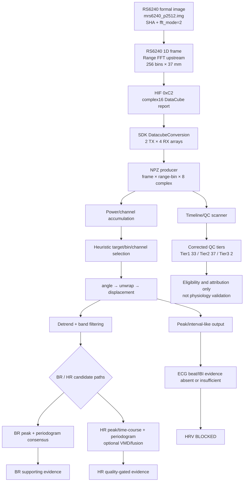

# Formal mmWave pipeline flowchart

```mermaid
flowchart TD
  A[RS6240 formal image\nmrs6240_p2512.img\nSHA + fft_mode=2] --> B[RS6240 1D frame\nRange FFT upstream\n256 bins × 37 mm]
  B --> C[HIF 0xC2\ncomplex16 DataCube report]
  C --> D[SDK DatacubeConversion\n2 TX × 4 RX arrays]
  D --> E[NPZ producer\nframe × range-bin × 8 complex]
  E --> F[Power/channel accumulation]
  F --> G[Heuristic target/bin/channel selection]
  G --> H[angle → unwrap → displacement]
  H --> I[Detrend + band filtering]
  I --> J{BR / HR candidate paths}
  J --> K[BR peak + periodogram consensus]
  J --> L[HR peak/time-course + periodogram\noptional VMD/fusion]
  K --> M[BR supporting evidence]
  L --> N[HR quality-gated evidence]
  H --> O[Peak/interval-like output]
  O --> P[ECG beat/IBI evidence absent or insufficient]
  P --> Q[HRV BLOCKED]
  E --> R[Timeline/QC scanner]
  R --> S[Corrected QC tiers\nTier1 33 / Tier2 37 / Tier3 2]
  S --> T[Eligibility and attribution only\nnot physiology validation]
```

实线表示已有证据闭环；`target/bin/channel`、校准、TDM timing 和 HRV beat validation 仍是边界或缺口。
